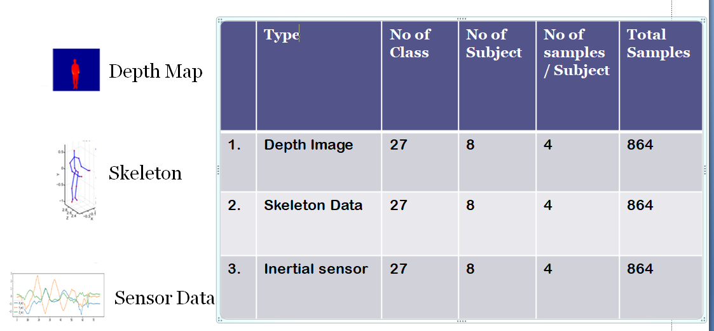
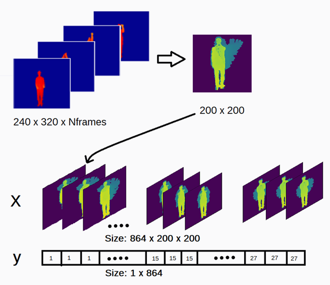
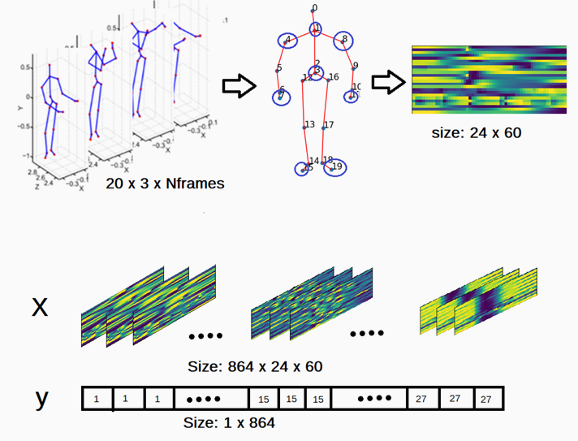
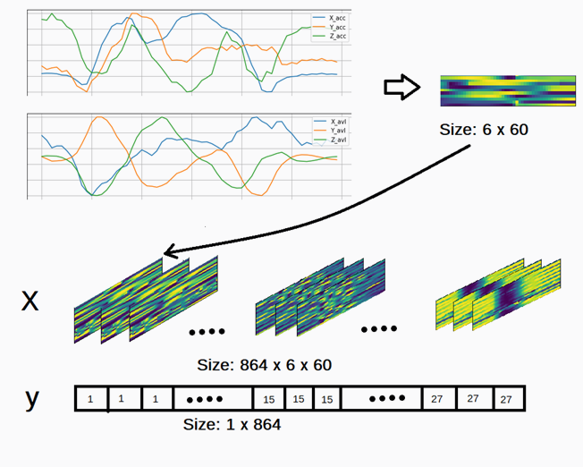
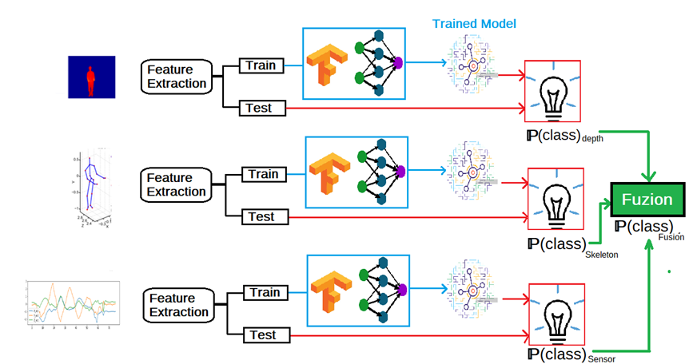

# Action-Recognition-kinect
Human Action Recognition using Depthmap, Skeleton and Sensor data.

The objective of this project is to apply machine learning algorithms to recognise human action. 

The project can be divided into three parts 1. Data Acquisition, 2. Feature Extraction, 3. Training and Classification

# **Data Acquisition:**

The dataset for this project is downloaded from http://www.utdallas.edu/~kehtar/UTD-MHAD.html

In this dataset, three types of input data are provided for single action

**1. Depth Map:** Sequence of Depth frame where each frame consists of the depth value of each pixel.
**2. Skeleton:** Sequence of 20 body joint coordinates in 3 dimensions.
**3. Sensor:** accelerometer reading of wearable sensor.

database information

# **Feature Extraction:**

For simplicity very basic feature extraction techniques are applied to each data type.
**1. Depth map:** I first identified the minimum and the maximum value of each pixel and take a mean of it as a feature of that pixel.

**2. Skeleton:** The values of all 20 joints are interpolated to 60 points and stored as 20x60 matrix. This matrix is considered as a feature matrix.

**3. Sensor:** Similar to last step all sensor data are interpolated to 60 joints and stored as 6 x60 feature matrix.

All above features are stored in 3D matrix and used as input to modeling.

# **Modelling:**

**Block diagram**

TensorFlow is used for modeling. Three different models are trained for each data types. The model gives probability of each class as an output. Then the class with highest probability is declared as recognized class. To take advantage of each model we have fuzed the probability of three model output.
For proof of concept we have done above experiment with different train and test ratio.
## **Conclution:**
Skeleton Data gives highest accuracy, recall and precision compare to Depth and sensor data, however combining all data’s output improves result.

